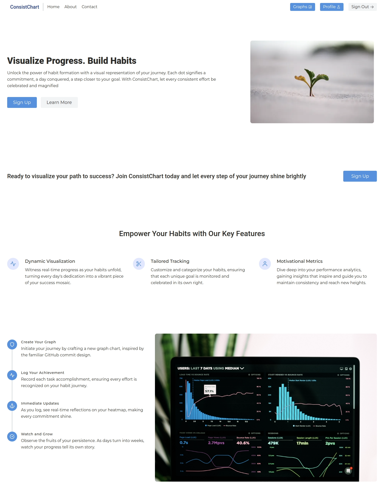
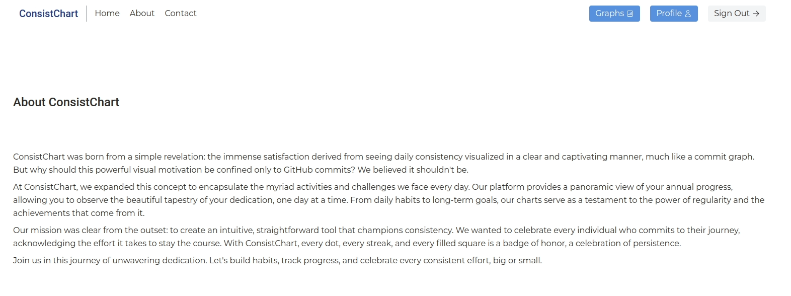
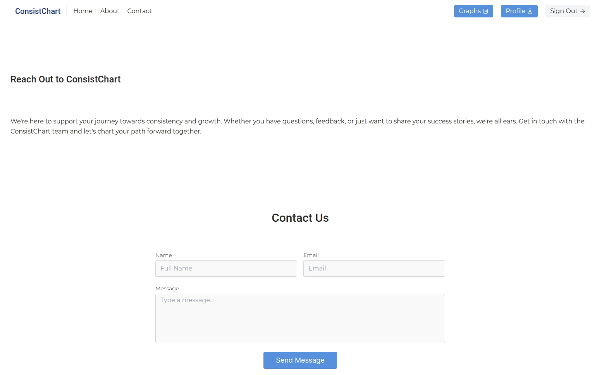
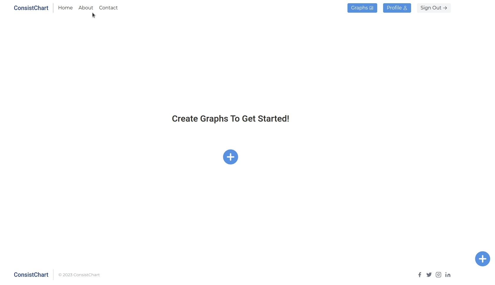
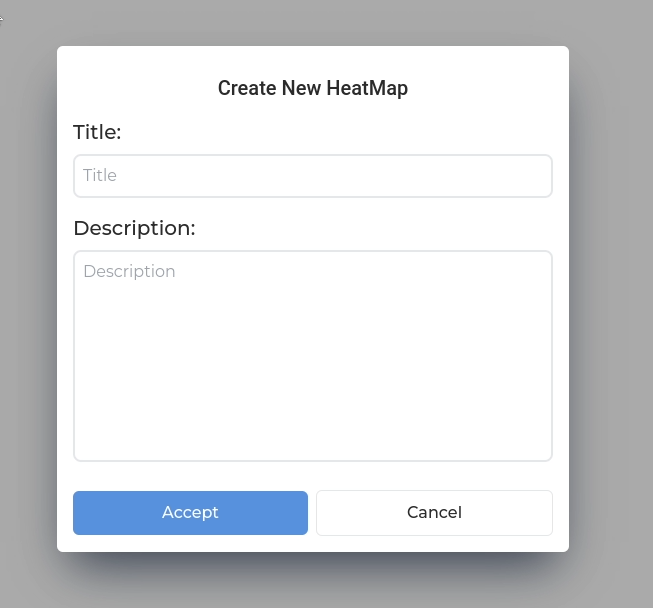
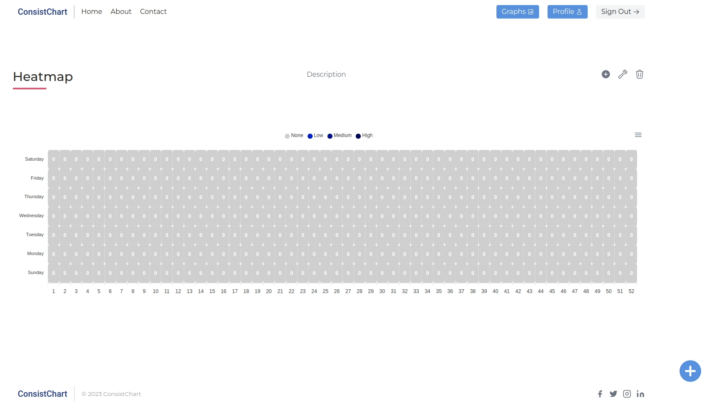
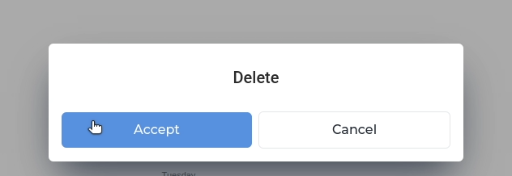
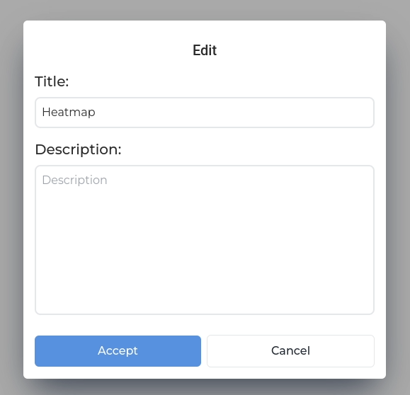
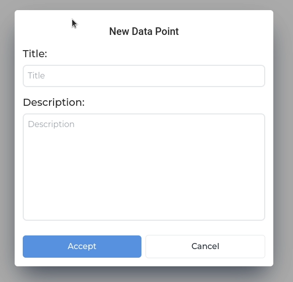

# ConsistChart - Habit Tracking Application

ConsistChart offers users a powerful visual representation of their habits over time. By leveraging heatmap graphs, reminiscent of GitHub's commit graph, users can seamlessly track their consistency in any habit they wish to monitor.

## Description

### Key Features:

#### User Authentication:

- Sign in securely with a Google account using next-auth.

#### Heatmap Management:

- Create a heatmap that visualizes your consistency in habits throughout the week.
- Insert data points to highlight your commitment on specific days.
- Personalize your heatmap with custom descriptions and titles.
- Remove heatmaps as and when required.

#### User Profile and Settings:

- Easily access and modify profile settings.
- Toggle between light and dark themes. (Under Construction)
- Adjust notification preferences. (Under Construction)
- Update your profile name (with more functionalities on the horizon).

### Technologies Used:

- Next.js: Provides the frontend framework with powerful server-side rendering capabilities.
- TypeScript: Ensures type safety, leading to robust code.
- Tailwind CSS: Offers utility-first CSS for efficient custom design crafting.
- Firebase: Acts as the backend solution for storing and fetching user data.
- next-auth: Guarantees secure user authentication.
- react-apexcharts: for heatmap creation

### Future Implementations:

I hope to implement these other features over time:

- [ ] Update the tooltip to show the commits for the day
- [ ] Add statistics to your consistency graph
- [ ] Add timezone information
- [ ] Light and Dark mode
- [ ] Send notifications

## Screenshots

## How to Install and Run

### Install

1. Clone the repository: `git clone https://github.com/KBMaglalang/heatmap`
2. Navigate to the project directory: `cd heatmap`
3. Install the necessary packages: `npm install` or `npm i`
4. Copy the `.env.example` file. You can create either `.env.local` or `.env` based on your preference
5. Open the newly created .env or .env.local file and populate the fields with the required values. Ensure the necessary permissions are granted for any services or APIs you're connecting to.
6. Replace the configuration details in firebase.ts with your specific Firebase configuration information

### Run

1. Run `npm run dev`
2. Click on the link shown in the terminal, usually `localhost:3000`
3. Sign in and create an account by clicking on the center icon
